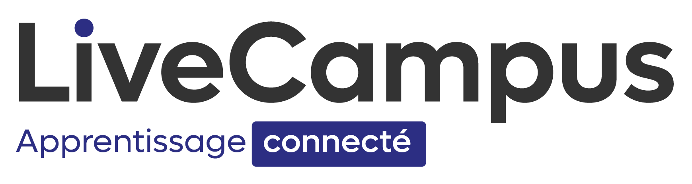

# 

## Promo : [MDV 2025]

### Développeurs :

- [Arthur Ferreira]
- [Tom Lebrun]
- [Lilian Vasconcelos]
- [Enzo Herichard]

---

## But du Script :

L'objectif de ce script est de **faciliter l'automatisation des tests unitaires** et de **notifier l'équipe de développement** après chaque `push`. Plus précisément, ce script permet :

- De détecter l'OS sur lequel il est exécuté.
- En fonction de l'OS détecté :
  - Vérifier si **VirtualBox** est installé, sinon fournir le lien de téléchargement.
  - Vérifier si **Docker** est installé, sinon fournir le lien de téléchargement.
  - Si Docker est installé, vérifier si le service est actif et l'activer si ce n'est pas le cas.
- Afficher un menu permettant :
  - De **créer une VM** (via VirtualBox), avec 2 CPU et un ISO Linux attaché.
  - De **créer un conteneur Docker**, en choisissant parmi plusieurs systèmes d'exploitation (Ubuntu, Debian, RockyLinux, Fedora, Python, MariaDB) et en demandant si un volume persistant doit être attaché.

Chaque fonctionnalité est **testée via `pytest`** et colorée à l'aide du module **`colorama`** (vert pour réussite, rouge pour échec). Un workflow GitHub exécute les tests unitaires à chaque `push`, et des notifications par email sont envoyées à l'équipe de développement ainsi qu'à l'intervenant.

---

## Dépôt :

Le dépôt créé pour ce projet se nomme : **lvcampus-env-3**.

---

## Utilisation :

1. **Cloner le dépôt** :

   ```bash
   git clone https://github.com/Lvscls/lvcampus-env-3.git
   cd lvcampus-env-3

   ```

2. **Créer un environnement virtuel** :
   ```bash
   python -m venv venv
   ```
   Pour l'activer via windows
   ```bash
   .\venv\Scripts\activate
   ```
   Pour linux
   ```bash
   source venv/bin/activate
   ```
3. **Installer les dépendances** :

   ```bash
   pip install -r requirements.txt

   ```

4. **Lancer le script + tests** :
   ```bash
   python script.py
   pytest
   ```
